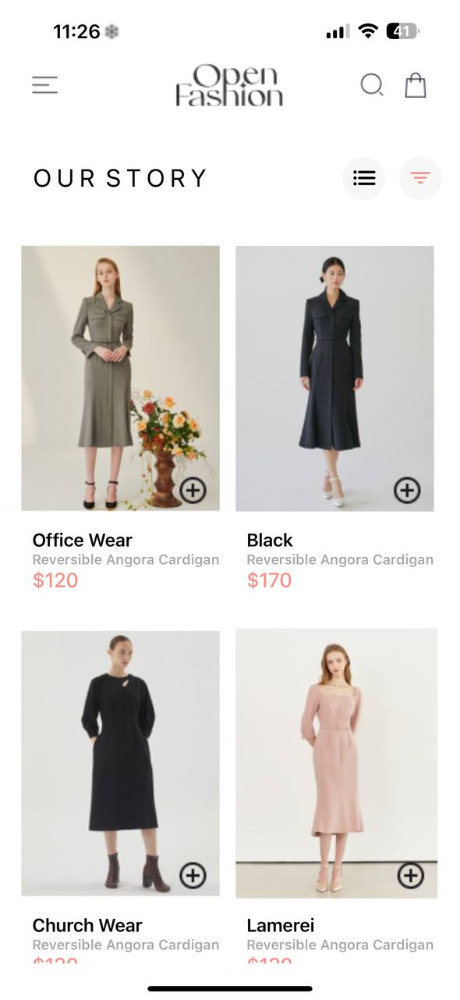
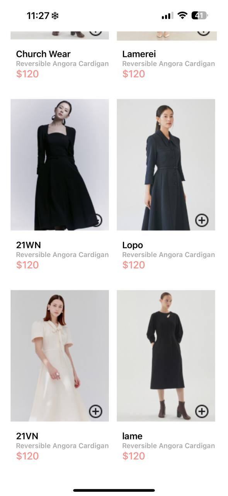
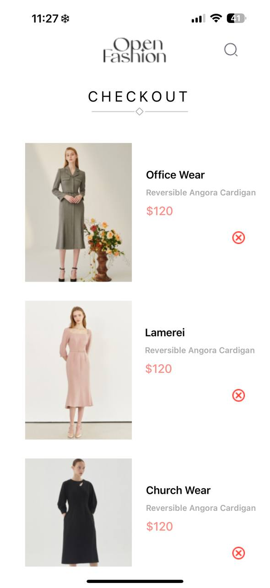

Project Overview
This project is a simple e-commerce mobile application built with React Native. It features a home screen displaying a list of products and a cart screen where users can view and manage items they've added to their cart. The key functionalities include adding items to the cart, displaying item details (including images), and removing items from the cart.

Design Choices
State Management
For state management, the app uses React's useContext and useReducer hooks to manage the global state of the cart. This approach ensures that the cart's state is easily accessible throughout the application and can be managed efficiently.

Data Storage
The app uses AsyncStorage from @react-native-async-storage/async-storage to persist the cart's state across app sessions. This means that even if the user closes the app, the items in the cart will remain when they reopen it.

Image Handling
Images are imported directly into the components and managed using a helper function (getImageSource) to ensure the correct image paths are used. This approach simplifies image management and ensures that images are displayed correctly in both the product list and the cart.

SCRENSHOTS

